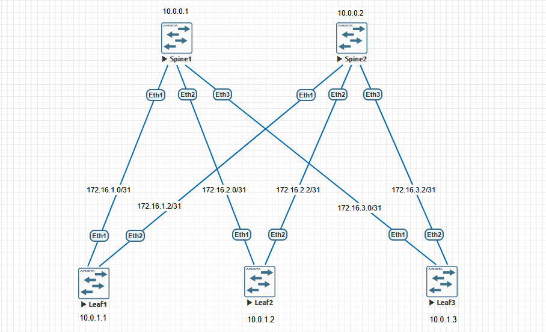

# Проектирование адресного пространства

### Цели:
1. Собрать топологию CLOS
2. Распределить адресное пространство для Underlay сети

### Topology:

### Networks Assignment:

| Spine RID   | Leaf RID    | P2P L1Sx      | P2P L2Sx      |
| ----------- | ----------- | ------------- | ------------- |
| 10.0.0.0/24 | 10.0.1.0/24 | 172.16.1.0/24 | 172.16.2.0/24 |

### RID Assignment:

Для Spine'ов пул из подсети 10.0.0.0/24
Для Leaf'ов пул из подсети 10.0.1.0/24

| Hostname |  Router ID  |
| :------: | :---------: |
|  spine1  | 10.0.0.1/32 |
|  spine2  | 10.0.0.2/32 |
|  leaf1   | 10.0.1.1/32 |
|  leaf2   | 10.0.1.2/32 |
|  leaf3   | 10.0.1.3/32 |

### P2P Networks:

|       |    spine1     |    spine2     |
| :---: | :-----------: | :-----------: |
| leaf1 | 172.16.1.0/31 | 172.16.1.2/31 |
| leaf2 | 172.16.2.0/31 | 172.16.2.2/31 |
| leaf3 | 172.16.3.0/31 | 172.16.3.2/31 |
