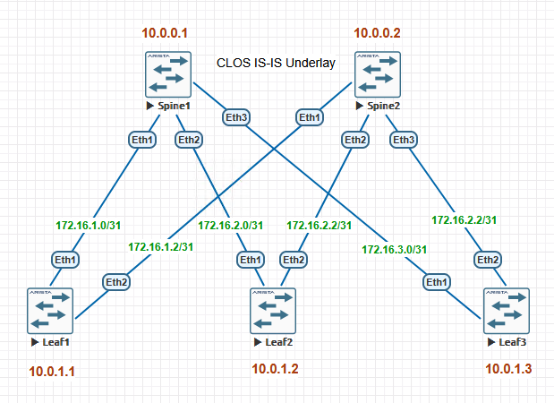
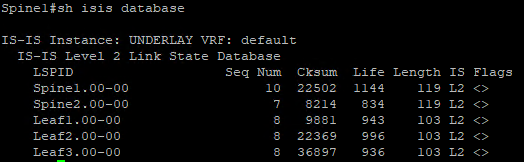
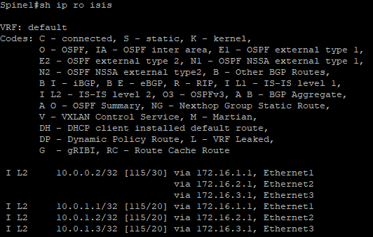
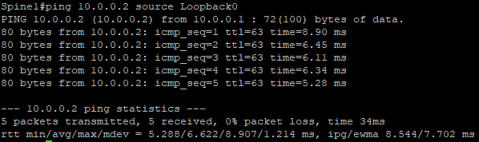
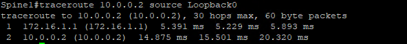
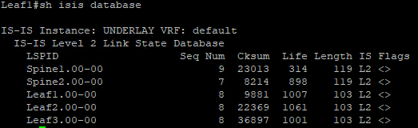
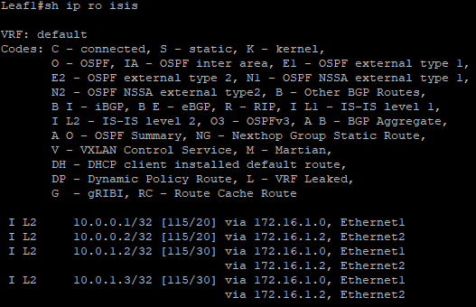
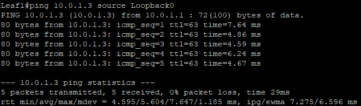
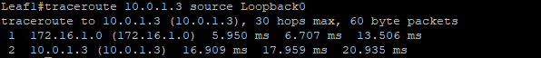

# Построение Underlay сети (ISIS)

## Цели:
1) Настроить ISIS для Underlay сети.
2) Зафиксировать план работ, адресное пространство, схему сети и конфигурацию устройств
3) Убедиться в наличии IP связанности между устройствами в OSPF домене

## План работ:
1) Подготовить конфигурации для топологии 2S3L в соответствии со схемой и IP планом из [лабораторной работы №1](/labs/lab01/README.MD).
2) Развернуть 5 хостов из образа Arista vEOS в Eve-NG.
3) Настроить в соответствии с подготовленными конфигурациями все хосты.
4) Проверить состояние ISIS на всех хостах, таблицы маршрутизации и сетевой связанности до loopback адресов других нод.

## Топология


## Описание
Для небольшой инфраструктуры принято решение использовать L2 соседство во всей Area 49.0001.
Для уменьшения таблицы маршрутизации в ISIS будут опубликованы только Loopback адреса устройств.
Для ISIS включен BFD глобально.
В каждом интерфейсе настроена аутентификация MD5 для ISIS.
На каждом интерфейсе включен Jumbo Frame.
В EVE-NG для портов установлен MTU 9214 для того чтобы ISIS заработал с Jumbo.

## Конфигурации устройств

<details>
<summary>Spine1.cfg</summary>

```eos
! device: Spine1 (vEOS-lab, EOS-4.29.2F)
!
! boot system flash:/vEOS-lab.swi
!
no aaa root
!
transceiver qsfp default-mode 4x10G
!
service routing protocols model multi-agent
!
hostname Spine1
!
spanning-tree mode mstp
!
interface Ethernet1
   description Leaf1-eth1
   mtu 9214
   no switchport
   ip address 172.16.1.0/31
   bfd interval 100 min-rx 100 multiplier 3
   isis enable UNDERLAY
   isis circuit-type level-2
   isis network point-to-point
   isis authentication mode md5 level-2
   isis authentication key 7 jSPakTULkp7wFIqBbZKIb/FHEwnXlBRU level-2
!
interface Ethernet2
   description Leaf2-eth1
   mtu 9214
   no switchport
   ip address 172.16.2.0/31
   bfd interval 100 min-rx 100 multiplier 3
   isis enable UNDERLAY
   isis circuit-type level-2
   isis network point-to-point
   isis authentication mode md5 level-2
   isis authentication key 7 jSPakTULkp7wFIqBbZKIb/FHEwnXlBRU level-2
!
interface Ethernet3
   mtu 9214
   no switchport
   ip address 172.16.3.0/31
   bfd interval 100 min-rx 100 multiplier 3
   isis enable UNDERLAY
   isis circuit-type level-2
   isis network point-to-point
   isis authentication mode md5 level-2
   isis authentication key 7 jSPakTULkp7wFIqBbZKIb/FHEwnXlBRU level-2
!
interface Loopback0
   ip address 10.0.0.1/32
   isis enable UNDERLAY
   isis passive
!
interface Management1
!
ip routing
!
router isis UNDERLAY
   net 49.0001.0100.0000.0001.00
   is-hostname Spine1
   router-id ipv4 10.0.0.1
   is-type level-2
   log-adjacency-changes
   lsp size maximum 8900
   advertise passive-only
   spf-interval 5 50 500
   timers lsp generation 5 50 500
   !
   address-family ipv4 unicast
      maximum-paths 32
      bfd all-interfaces
!
end
```
</details>

<details>
<summary>Spine2.cfg</summary>

```eos
! device: Spine2 (vEOS-lab, EOS-4.29.2F)
!
! boot system flash:/vEOS-lab.swi
!
no aaa root
!
transceiver qsfp default-mode 4x10G
!
service routing protocols model multi-agent
!
hostname Spine2
!
spanning-tree mode mstp
!
interface Ethernet1
   description Leaf1-eth1
   mtu 9214
   no switchport
   ip address 172.16.1.2/31
   bfd interval 100 min-rx 100 multiplier 3
   isis enable UNDERLAY
   isis circuit-type level-2
   isis network point-to-point
   isis authentication mode md5 level-2
   isis authentication key 7 jSPakTULkp7wFIqBbZKIb/FHEwnXlBRU level-2
!
interface Ethernet2
   description Leaf2-eth1
   mtu 9214
   no switchport
   ip address 172.16.2.2/31
   bfd interval 100 min-rx 100 multiplier 3
   isis enable UNDERLAY
   isis circuit-type level-2
   isis network point-to-point
   isis authentication mode md5 level-2
   isis authentication key 7 jSPakTULkp7wFIqBbZKIb/FHEwnXlBRU level-2
!
interface Ethernet3
   mtu 9214
   no switchport
   ip address 172.16.3.2/31
   bfd interval 100 min-rx 100 multiplier 3
   isis enable UNDERLAY
   isis circuit-type level-2
   isis network point-to-point
   isis authentication mode md5 level-2
   isis authentication key 7 jSPakTULkp7wFIqBbZKIb/FHEwnXlBRU level-2
!
interface Loopback0
   ip address 10.0.0.2/32
   isis enable UNDERLAY
   isis passive
!
interface Management1
!
ip routing
!
router isis UNDERLAY
   net 49.0001.0100.0000.0002.00
   is-hostname Spine2
   router-id ipv4 10.0.0.2
   is-type level-2
   log-adjacency-changes
   advertise passive-only
   spf-interval 5 50 500
   timers lsp generation 5 50 500
   !
   address-family ipv4 unicast
      maximum-paths 32
      bfd all-interfaces
!
end
```
</details>

<details>
<summary>Leaf1.cfg</summary>

```eos
! device: Leaf1 (vEOS-lab, EOS-4.29.2F)
!
! boot system flash:/vEOS-lab.swi
!
no aaa root
!
transceiver qsfp default-mode 4x10G
!
service routing protocols model multi-agent
!
hostname Leaf1
!
spanning-tree mode mstp
!
interface Ethernet1
   description Spine1-eth1
   mtu 9214
   no switchport
   ip address 172.16.1.1/31
   bfd interval 100 min-rx 100 multiplier 3
   isis enable UNDERLAY
   isis circuit-type level-2
   isis network point-to-point
   isis authentication mode md5 level-2
   isis authentication key 7 jSPakTULkp7wFIqBbZKIb/FHEwnXlBRU level-2
!
interface Ethernet2
   description Spine2-eth1
   mtu 9214
   no switchport
   ip address 172.16.1.3/31
   bfd interval 100 min-rx 100 multiplier 3
   isis enable UNDERLAY
   isis circuit-type level-2
   isis network point-to-point
   isis authentication mode md5 level-2
   isis authentication key 7 jSPakTULkp7wFIqBbZKIb/FHEwnXlBRU level-2
!
interface Ethernet3
!
interface Loopback0
   ip address 10.0.1.1/32
   isis enable UNDERLAY
   isis passive
!
interface Management1
!
ip routing
!
router isis UNDERLAY
   net 49.0001.0100.0000.1001.00
   is-hostname Leaf1
   router-id ipv4 10.0.1.1
   is-type level-2
   log-adjacency-changes
   advertise passive-only
   spf-interval 5 50 500
   timers lsp generation 5 50 500
   !
   address-family ipv4 unicast
      maximum-paths 32
      bfd all-interfaces
!
end
```
</details>

<details>
<summary>Leaf2.cfg</summary>

```eos
! device: Leaf2 (vEOS-lab, EOS-4.29.2F)
!
! boot system flash:/vEOS-lab.swi
!
no aaa root
!
transceiver qsfp default-mode 4x10G
!
service routing protocols model multi-agent
!
hostname Leaf2
!
spanning-tree mode mstp
!
interface Ethernet1
   description Spine1-eth1
   mtu 9214
   no switchport
   ip address 172.16.2.1/31
   bfd interval 100 min-rx 100 multiplier 3
   isis enable UNDERLAY
   isis circuit-type level-2
   isis network point-to-point
   isis authentication mode md5 level-2
   isis authentication key 7 jSPakTULkp7wFIqBbZKIb/FHEwnXlBRU level-2
!
interface Ethernet2
   description Spine2-eth1
   mtu 9214
   no switchport
   ip address 172.16.2.3/31
   bfd interval 100 min-rx 100 multiplier 3
   isis enable UNDERLAY
   isis circuit-type level-2
   isis network point-to-point
   isis authentication mode md5 level-2
   isis authentication key 7 jSPakTULkp7wFIqBbZKIb/FHEwnXlBRU level-2
!
interface Ethernet3
!
interface Loopback0
   ip address 10.0.1.2/32
   isis enable UNDERLAY
   isis passive
!
interface Management1
!
ip routing
!
router isis UNDERLAY
   net 49.0001.0100.0000.1002.00
   is-hostname Leaf2
   router-id ipv4 10.0.1.2
   is-type level-2
   log-adjacency-changes
   advertise passive-only
   spf-interval 5 50 500
   timers lsp generation 5 50 500
   !
   address-family ipv4 unicast
      maximum-paths 32
      bfd all-interfaces
!
end
```
</details>

<details>
<summary>Leaf3.cfg</summary>

```eos
! device: Leaf3 (vEOS-lab, EOS-4.29.2F)
!
! boot system flash:/vEOS-lab.swi
!
no aaa root
!
transceiver qsfp default-mode 4x10G
!
service routing protocols model multi-agent
!
hostname Leaf3
!
spanning-tree mode mstp
!
interface Ethernet1
   description Spine1-eth1
   mtu 9214
   no switchport
   ip address 172.16.3.1/31
   bfd interval 100 min-rx 100 multiplier 3
   isis enable UNDERLAY
   isis circuit-type level-2
   isis network point-to-point
   isis authentication mode md5 level-2
   isis authentication key 7 jSPakTULkp7wFIqBbZKIb/FHEwnXlBRU level-2
!
interface Ethernet2
   description Spine2-eth1
   mtu 9214
   no switchport
   ip address 172.16.3.3/31
   bfd interval 100 min-rx 100 multiplier 3
   isis enable UNDERLAY
   isis circuit-type level-2
   isis network point-to-point
   isis authentication mode md5 level-2
   isis authentication key 7 jSPakTULkp7wFIqBbZKIb/FHEwnXlBRU level-2
!
interface Ethernet3
!
interface Loopback0
   ip address 10.0.1.3/32
   isis enable UNDERLAY
   isis passive
!
interface Management1
!
ip routing
!
router isis UNDERLAY
   net 49.0001.0100.0000.1003.00
   is-hostname Leaf3
   router-id ipv4 10.0.1.3
   is-type level-2
   log-adjacency-changes
   advertise passive-only
   spf-interval 5 50 500
   timers lsp generation 5 50 500
   !
   address-family ipv4 unicast
      maximum-paths 32
      bfd all-interfaces
!
end
```
</details>

## Проверка сетевой связанности

### Spine1





### Leaf1



